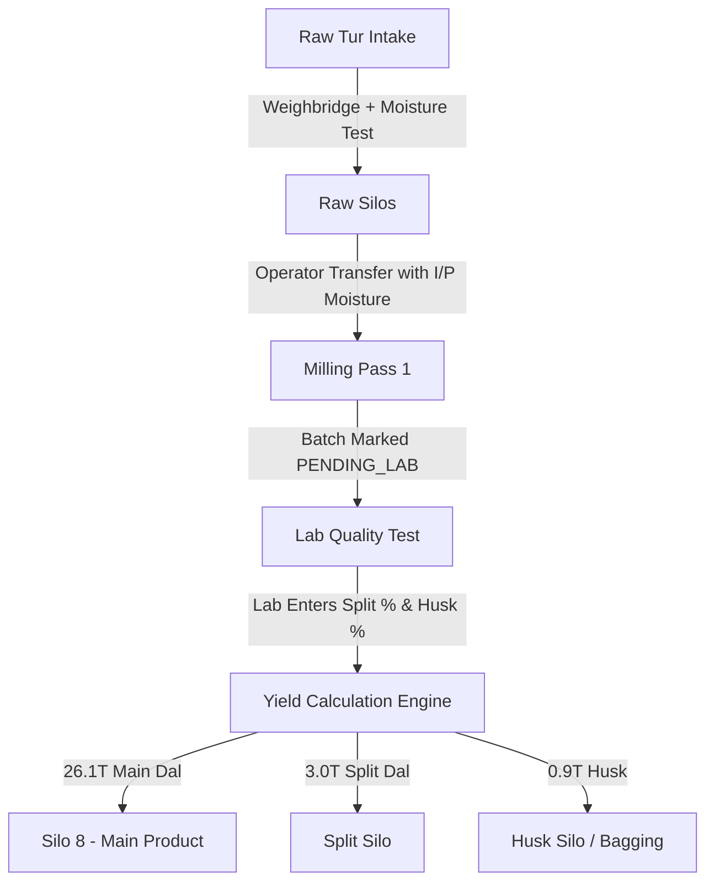

# PulseTrack: Intelligent Dal Mill Management Platform
## Executive System Overview & Client Implementation Report
*Version 1.2 — Prepared for Mill Management & Stakeholders*

---

## 1. Executive Summary

**PulseTrack** is a digital operations and inventory management platform tailored specifically for commercial **Toor Dal milling operations**. 

It eliminates error-prone paper logbooks and manual ledger guesswork by establishing a **real-time, double-entry digital ledger** across all processing phases:
- **Raw Material Intake** (weighbridge & moisture lab test)
- **Multi-Pass Milling** (de-husking, conditioning, oiling, splitting, color sorting)
- **Multi-Silo Storage** (live stock balances, fill levels, and idle downtime tracking)
- **Lab Yield & Quality Engine** (byproduct-first percentages with auto-derived main recovery)
- **Finished Goods & Byproduct Dispatches** (Husk, Chunni, Broken / Tukda, Finished Dal)

All **7 client-specified engineering requirements** have been fully developed, verified through automated end-to-end tests, and deployed into the mobile operator app and management dashboard.

---

## 2. Client Requirements Implemented

### 1. Dynamic Yield Formula (Processing Base × Lab Yield %)
- **Formula**: Yield distribution is calculated on **Physical Quantity Processed × Lab Percentage**.
- **Byproduct-First Input**: The lab operator only enters the byproduct percentages (Split % and Husk %); the system auto-derives the Main Toor Dal yield as $100\% - \text{Split}\% - \text{Husk}\%$.
- **Real-World Client Example**:
  - Shift 1 processes **30 Tons** from Silo 4 to Silo 8.
  - Lab enters **10% Split** and **3% Husk** $\rightarrow$ Main Toor Dal is auto-calculated at **87%**.
  - **Outputs Posted to Silos**:
    - **Silo 8 (Main Toor Dal)**: $30 \times 87\% =$ **26.1 Tons**
    - **Split Silo**: $30 \times 10\% =$ **3.0 Tons**
    - **Husk Silo**: $30 \times 3\% =$ **0.9 Tons**
  - All three balances are credited to their respective destination silos simultaneously in an atomic transaction.

---

### 2 & 3. Dual Moisture Pools (Input and Output Deductions)
- **Threshold**: Industry-standard **10% Base Moisture**.
- **Rule**:
  - If Moisture $\le 10\%$: **No deduction** (100% full weight retained; no system error).
  - If Moisture $> 10\%$: $\text{Deduction (kg)} = \text{Weight} \times \frac{\text{Moisture}\% - 10}{100}$.
- **Input (I/P) Pool**:
  - At raw intake or initial pass: 30 Tons gross @ 13% moisture $\rightarrow$ 3% deduction (900 kg) $\rightarrow$ **29.1 Tons net**.
- **Output (O/P) Pool**:
  - At milling discharge: 30 Tons gross @ 12% moisture $\rightarrow$ 2% deduction (600 kg) $\rightarrow$ **29.4 Tons net** deducted from stock.

---

### 4. Silo Idle Time Tracking
- **Calculation**: $\text{Idle Duration} = \text{Current Time} - \text{Last Transaction Time}$.
- **Display**: Formatted in real-time as `Active now`, `14m idle`, `4h 25m idle`, `2d 3h idle`.
- **Alerts**: Silos inactive for $>8$ hours highlight with a prominent warning badge to alert supervisors of jammed elevators, stalled batches, or dead storage.

---

### 5. Automated Ledger vs Manual Stock Adjustments
- **Automated Ledger**: Every intake receiving, production transfer, and lab yield entry automatically posts credits and debits to silo balances. Zero ghost stock.
- **Manual Adjustments**: Reserved exclusively for physical weighbridge calibration, physical stocktaking corrections, or direct silo transfers. Includes a mandatory reason/notes field and writes an immutable audit record.

---

### 6. Real Factory Silo Topography (Digital Twin)
Seeded directly from handwritten plant floor layouts:
- **Unit 02 (41 Silos)**: Heating Stock (1–2), Kaacha Tur, Machine Clean (1–2), Adkan, Single Oil (1–7), Double Oil (1–4), Chunni (1–2), Tukadi, Fatka, Sortex, Rejection (1–3), Sakla No, Dryer.
- **Unit 03 (23 Silos)**: Kaacha Tur (1–3), Chunni, Polish Dal (1–2), Heating Stock, Single Oil, Single Role Dal (1–4), Kora, Fatka Kora, Kaacha Dal, Tukada Chilka, Return Gota, Non Sortex, Rejection.
- **19 Grain Mill Materials**: Covering every processing phase from raw pulses to graded finished dal and secondary byproducts.

---

### 7. Role-Based Command Centers
- **Supervisor Portal**:
  - Total factory stock in tons.
  - Active vs idle silo meters with fill level gauges.
  - Exception stream showing pending lab yield approvals.
  - Recent audit logs with timestamps and operator IDs.
- **Operator Mobile Terminal**:
  - Horizontal quick-view cards for all silos in their unit.
  - Quick buttons for New Intake, New Transfer, and Shift Handover.
  - Real-time moisture deduction preview before submitting transfers.

---

## 3. End-to-End Milling Lifecycle

---

## 4. Quality & Audit Verification

- **Backend Test Suite**: **21 / 21 Tests Passed (100% Green)**
  - Dual moisture deduction algorithms tested.
  - 30T @ 13% $\rightarrow$ 29.1T, 87/10/3 yield $\rightarrow$ 26.1 / 3.0 / 0.9 tons verified.
  - Silo idle time calculation and formatting verified.
- **Frontend Code Quality**: **0 TypeScript Errors**
  - Fully type-safe React Native mobile code.
  - Unhandled promise rejection handlers added to all screen loaders.

---

## 5. Summary of Files & Deliverables

| File | Description |
|---|---|
| [`PulseTrack_System_Overview.html`](file:///d:/pulse-track/PulseTrack_System_Overview.html) | **Print-ready executive report**. Open in Chrome/Edge and click *"Print / Save as PDF"*. |
| [`PULSETRACK_CLIENT_OVERVIEW.md`](file:///d:/pulse-track/PULSETRACK_CLIENT_OVERVIEW.md) | Markdown document ready for emails, documentation portals, or client sharing. |
| [`backend/src/services/yieldService.js`](file:///d:/pulse-track/backend/src/services/yieldService.js) | Yield calculation engine with byproduct auto-derivation. |
| [`backend/src/services/moistureService.js`](file:///d:/pulse-track/backend/src/services/moistureService.js) | Dual I/P and O/P moisture deduction pool algorithms. |
| [`backend/src/utils/seed.js`](file:///d:/pulse-track/backend/src/utils/seed.js) | Digital twin seed data for 69 silos across Unit 1, Unit 2, and Unit 3. |
